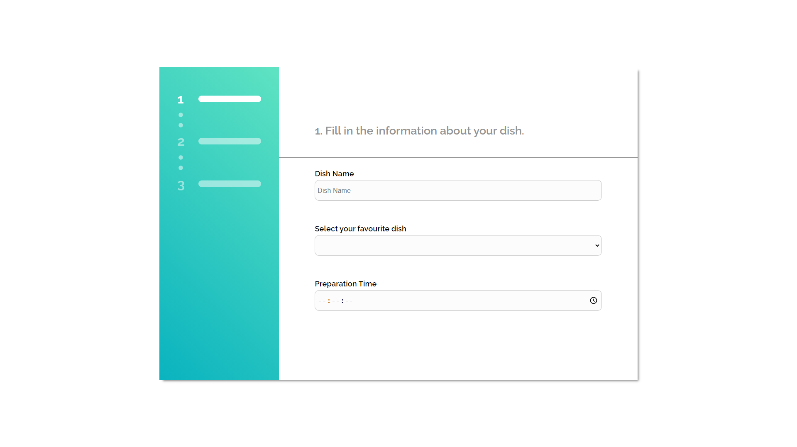
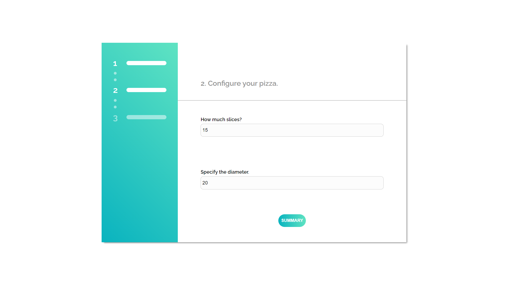
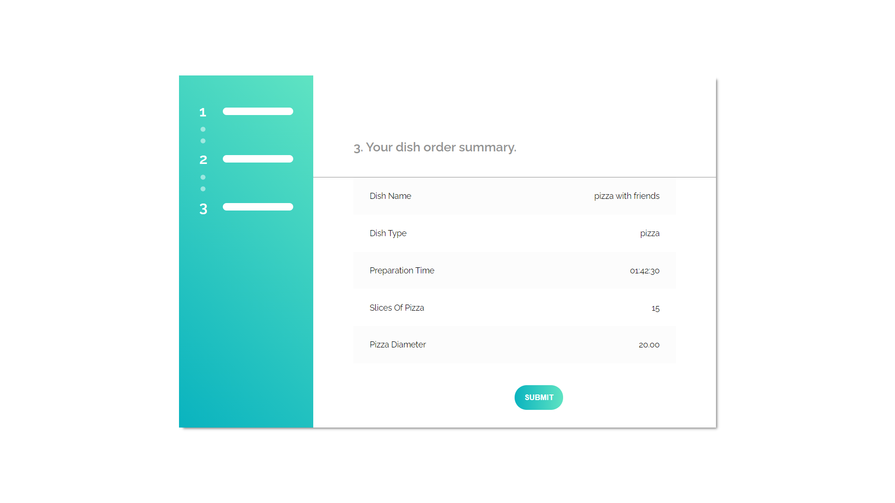

## CHECK IT ONLINE!

https://react-dish-form.herokuapp.com/

<p align="center">

  <h2 align="center">Dish Form</h2>

  <p align="center">
   React application with dish form.
    <br />
  </p>
</p>

## About The Project


<br>

<br>

<br>

<p align="center">
React form where user can pick his favourite dish, configured it and and place an order.
</p>

### Installing

Clone the Repository and run

```
npm install
npm start
```

### Built With

-  React
-  Redux
-  Styled Components
-  React Final Form
-  Java Script
-  Responsive Web Design
